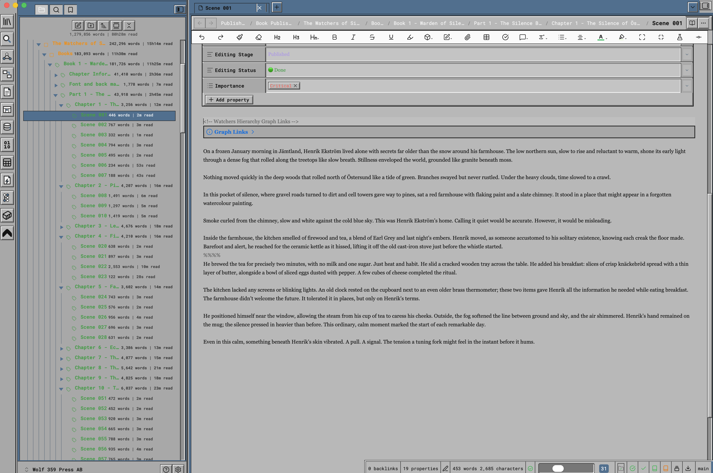
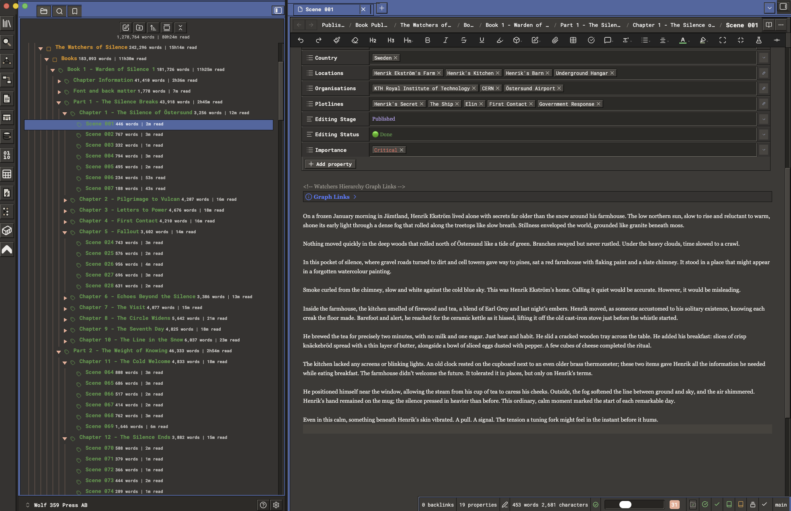

# Amiga Workbench 3.1 for Obsidian

**Warm grey, blue title bars, and the salmon and beige of the eight-colour desktop.**

> **This is an independent, unofficial, fan-made theme.**
> It is **not affiliated with, endorsed by, sponsored by, approved by, or connected to**
> Amiga Corporation, Amiga Inc., Cloanto, Hyperion Entertainment, the former Commodore
> International, or any other present or former owner of the Amiga, Commodore, Kickstart
> or Workbench trademarks. Nothing here is official. The developer has no relationship
> with any of those parties. The theme is *inspired by* a remembered visual style — it is
> not a reproduction of one, and it ships no original Amiga assets of any kind.

---

## What this is

Workbench 3.1 is the mature form. Visually it inherits the 1990 redesign almost
unchanged — the same raised gadgets, the same recessed fields, the same square geometry —
because there was no second redesign. What changed underneath was colour depth. On the
AGA machines, an A1200 or an A4000, Workbench came up in **eight colours rather than
four**, and the four it added were a mid grey, a light grey, a warm beige and a salmon
pink.

Those extras are the reason a 3.1 desktop is remembered as warmer than a 2.04 one. They
were used for icon shading and drawer artwork, and they gave the whole environment a
softer cast that the strict four-colour 2.0 palette could not produce. This theme leans
on exactly that: the greys are tinted toward the beige, the pictograms are drawn in it,
and the salmon serves as the interactive accent.

The relief is 2.04's, with one refinement the later style guide did bring — a mid-tone
step inside the window frame, and more generous spacing around controls. It is the most
comfortable of the three to sit in front of for a long stretch.

## Why you might choose this one

**Pick 3.1 when you want the classic Workbench look at its most comfortable.** It has
the same dimensional gadgets as 2.04 but more room around them, and the warm greys are
easier on the eye over a long session than 2.04's cool neutral. Historically 2.04 and 3.1
looked very alike — this theme separates them the way the era actually did, by
temperature and colour depth rather than by inventing differences that never existed.

## The palette

Every colour below is stated plainly so you can see exactly what the theme does. Nothing
is hidden behind a gradient or an image.

| Role | Value | Notes |
| --- | --- | --- |
| Screen | `#9b948e` | A warm grey desktop, tinted toward the eight-colour beige |
| Windows | `#aea6a0` | Warm light-grey working surfaces |
| Panels | `#a59d97` | Explorer and sidebars |
| Title bars | `#3b67a2` | A cleaner, more saturated blue than 2.04's |
| Accent | `#ffa997` | The eight-colour salmon. Disclosure arrows, active gadgets, focus in dark mode |
| Pictograms | `#aa907c` | The eight-colour beige, as the drawer artwork used it |

## The geometry

| Property | Value | Notes |
| --- | --- | --- |
| Relief | 2px, full, plus a frame step | 3.x kept 2.0's gadget and refined the frame |
| Border width | 2px bevels with a mid-tone inner step | The window frame gains a third layer |
| Corner radius | 0 | Square throughout |
| Spacing unit | 0.5rem | The most generous of the three |
| Control height | 2.125rem | The largest gadgets |

<!-- SCREENSHOT 03 -->
> ### 📷 Screenshot 03 — Ribbon, explorer and tab bar detail
> **Save as:** `docs/images/03-chrome-detail.png`
>
> **What this image must show:** A close crop of the left-hand chrome: the ribbon with its hand-drawn pictograms, the file explorer showing nested folders with their disclosure triangles and connector rails, and the tab bar along the top with at least three tabs open and one active.
>
> **How to capture it:**
> 1. Light mode, as Screenshot 01.
> 2. Open **three or four tabs** so the tab bar is populated and one is clearly active.
> 3. Expand folders to at least **three levels deep** so the indentation is obvious.
> 4. Capture the whole window as above, then crop to the left third plus the tab bar — roughly **700 × 600**.
> 5. Do not scale the image down afterwards; these are pixel-drawn details and they blur easily.
>
> *Delete this block and replace it with:* ``

## What is covered

The theme styles the whole application, not just the editor:

- **Workspace shell** — ribbon, tab bar, view headers, status bar, pane dividers
- **File explorer** — indentation, disclosure triangles, connector rails, selection
- **Editor and reading view** — headings, lists, links, code, tables, callouts, quotes
- **Properties** — rebuilt as a Workbench-style requester with a keyed column
- **Command palette and quick switcher** — recessed entry field, square result rows,
  keyboard hints drawn as small raised gadgets
- **Menus, modals, notices and tooltips** — hard frames, title strips, solid selection
- **Canvas, graph, Bases and backlinks** — consistent surface and control treatment
- **Settings** — including when opened in its own window

<!-- SCREENSHOT 04 -->
> ### 📷 Screenshot 04 — Editor, properties and callouts
> **Save as:** `docs/images/04-editor-and-properties.png`
>
> **What this image must show:** A note open in the editor showing the properties table at the top with four or five fields filled in, a heading, body text, an inline code span, a fenced code block and a callout. This demonstrates the reading surface rather than the chrome.
>
> **How to capture it:**
> 1. Light mode.
> 2. Create or open a note with frontmatter containing at least **four properties** of mixed types — text, list, date, checkbox.
> 3. Below it add a heading, a paragraph, a `> [!note]` callout and a fenced code block.
> 4. Make sure the properties table is **expanded**, not collapsed.
> 5. Capture the editor pane only — collapse the sidebars first if it helps — roughly **900 × 800**.
>
> *Delete this block and replace it with:* ``

## Installation

### From Obsidian's Community Themes browser

1. Open **Settings → Appearance**.
2. Under **Themes**, choose **Manage**.
3. Search for **Amiga Workbench 3.1**.
4. Select it and choose **Use**.

### Manually

1. Download `theme.css` and `manifest.json` from this repository.
2. Place both in `YourVault/.obsidian/themes/Amiga Workbench 3.1/` — the folder name must match exactly.
3. In Obsidian, go to **Settings → Appearance → Themes** and select **Amiga Workbench 3.1**.
4. If it does not appear, close and reopen Obsidian.

## Light and dark

Both modes are designed, not generated. Switch with **Settings → Appearance → Base theme**.
No plugin is involved.

Dark mode carries the blue title hierarchy and the warm accents onto a warm-tinted
dark screen, keeping it distinct from 2.04's neutral charcoal.

## Fonts

The theme follows *your* typography settings. Set **Settings → Appearance → Interface font,
Text font, Monospace font** and **Font size**, and the entire interface follows — including
the tab bar, view headers, file explorer and status bar.

Leave them unset and the theme's own stack applies. It never overrides a font you have
chosen.

## Requirements

- Obsidian **1.6.0** or later
- No plugins. The theme is plain CSS and works on its own.

Optional: if you already use the **Style Settings** plugin, a few extra toggles appear.
They are described in the [User Guide](USERGUIDE.md). Without the plugin the theme is
complete and unchanged.

## Accessibility

- Every text and background pair is contrast-checked in both light and dark modes
- Keyboard focus is always visible, with a dedicated focus colour
- `prefers-reduced-motion` is respected
- `prefers-contrast: more` strengthens frames and removes muted text
- Printing and PDF export drop the screen palette for black on white

## Documentation

- **[User Guide](USERGUIDE.md)** — a fuller walkthrough, including customisation and
  troubleshooting

## Where this comes from

This theme is generated from a shared source repository,
[obsidian-amiga-inspired-theme](https://github.com/anthonyfitzpatrick/obsidian-amiga-inspired-theme),
which builds Workbench 1.3, 2.04 and 3.1 from one structural contract. The three differ in
colour and in a small, declared set of style values — relief depth, spacing, control size —
and nothing else.

`theme.css` in this repository is a **generated build artifact**. Please send fixes and
suggestions to the source repository rather than editing it here.

## Trademarks, affiliation and intellectual property

Please read this section in full. It matters.

### No affiliation whatsoever

Amiga Workbench 3.1 for Obsidian is an **independent, unofficial, community-created theme**. The
developer is a private individual with **no relationship of any kind** to:

- Amiga Corporation, Amiga Inc., or any entity trading under the Amiga name
- Cloanto Corporation, holders of Commodore/Amiga ROM and Workbench copyrights
- Hyperion Entertainment, developers and rights-holders of later AmigaOS releases
- The former Commodore International, Commodore Business Machines, or their successors
- Haage & Partner, or any other historical Amiga software publisher
- Any present, former or claimed owner of the Amiga, Commodore, Kickstart, AmigaOS or
  Workbench trademarks, in any territory

There is **no endorsement, sponsorship, approval, licence, partnership, or association**,
express or implied. Nothing in this project should be read as suggesting otherwise. If
you have arrived here believing this is an official product, it is not.

### Why the name refers to Workbench at all

The name is **descriptive, not proprietary**. It tells you which remembered look the
palette and proportions are drawn from — the mature Workbench of 1992–94 — in the same way a paint colour might be
called "racing green" without any claim on a car manufacturer. This is nominative use:
naming a thing in order to describe a resemblance to it. It is not a claim of origin,
authorship or authority.

The project's own framing is **"Amiga Inspired"**. Inspired by. Not a port, not a
recreation, not a replica, not a continuation, and not a substitute for anything real.

### No original assets are used or distributed

This theme is **CSS only**. It contains no copyrighted material from any Amiga or
Commodore product. Specifically, it does **not** contain, embed, adapt, trace, or
redistribute:

- Workbench, AmigaOS or Kickstart ROM code, or any part of any operating system
- Original Workbench icons, or any icon set derived from them
- MagicWB, NewIcons, GlowIcons, or any other third-party Amiga icon set
- Topaz or any other Amiga bitmap font, or any digitisation of one
- Original wallpapers, backdrops, pointers, brand marks or logos
- Screenshots of any Amiga system, used as an asset or otherwise

Every graphic in this theme is an **original drawing**, authored for this project as
inline SVG, using ordinary geometry. Colour values are stated as plain numbers. Colours
themselves are not copyrightable, and no artwork has been copied.

### Trademark acknowledgement

Amiga, AmigaOS, Kickstart and Workbench are trademarks or registered trademarks of their
respective owners. Commodore is a trademark of its respective owner. All such marks are
acknowledged as the property of those owners, and are used here only descriptively, to
identify the historical visual style that inspired this work.

Obsidian is a trademark of Dynalist Inc. This theme is a community theme for Obsidian and
is not produced by, endorsed by, or affiliated with Dynalist Inc.

### If you are a rights-holder

If you represent any rights-holder and consider anything in this project to overstep,
please open an issue on the repository. The developer's intention is respectful homage
within the bounds of independent creative work, and any specific, good-faith concern will
be addressed promptly and without argument.

### Licence

This theme is released under the **MIT Licence**. See [LICENSE](LICENSE) for the full
text. The MIT Licence covers **only the original CSS and documentation in this
repository**. It does not, and cannot, grant any rights in any third party's trademarks
or copyrighted works, and confers no rights in anything owned by the parties named above.
