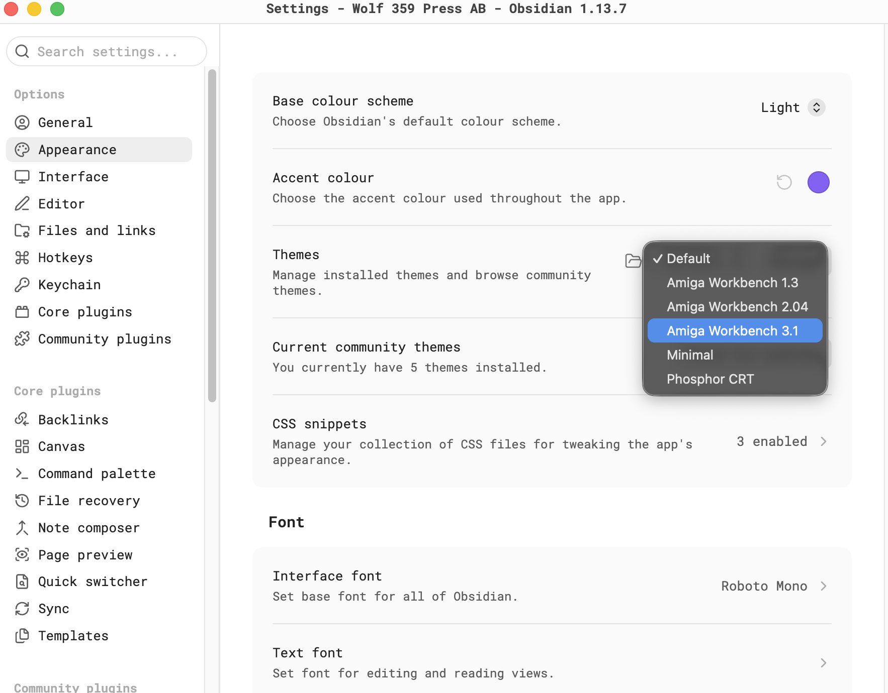
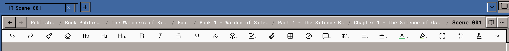
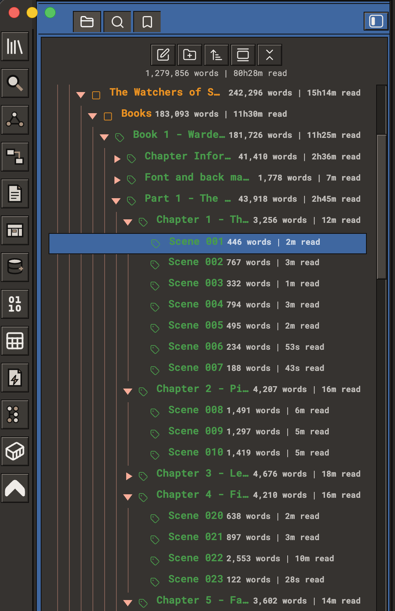
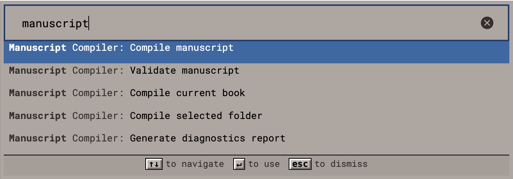

# Amiga Workbench 3.1 — User Guide

A complete guide to installing, using, customising and troubleshooting this theme.

> **This is an independent, unofficial, fan-made theme.**
> It is **not affiliated with, endorsed by, sponsored by, approved by, or connected to**
> Amiga Corporation, Amiga Inc., Cloanto, Hyperion Entertainment, the former Commodore
> International, or any other present or former owner of the Amiga, Commodore, Kickstart
> or Workbench trademarks. Nothing here is official. The developer has no relationship
> with any of those parties. The theme is *inspired by* a remembered visual style — it is
> not a reproduction of one, and it ships no original Amiga assets of any kind.

---

## Contents

1. [Before you start](#before-you-start)
2. [Installing](#installing)
3. [Choosing light or dark](#choosing-light-or-dark)
4. [What the theme changes](#what-the-theme-changes)
5. [Typography and sizing](#typography-and-sizing)
6. [Accessibility](#accessibility)
7. [On mobile](#on-mobile)
8. [Printing and PDF export](#printing-and-pdf-export)
9. [Working alongside plugins and snippets](#working-alongside-plugins-and-snippets)
10. [Troubleshooting](#troubleshooting)
11. [Uninstalling](#uninstalling)
12. [Reporting problems](#reporting-problems)
13. [Trademarks, affiliation and intellectual property](#trademarks-affiliation-and-intellectual-property)

---

## Before you start

You need **Obsidian 1.6.0 or later**. You do not need any plugins — this theme is plain
CSS and is complete on its own.

It is worth knowing what this theme is trying to do, because it will explain some of its
choices. Warm grey, blue title bars, and the salmon and beige of the eight-colour desktop. It is drawn from the mature Workbench of 1992–94, and it deliberately keeps the
proportions and restraint of that era rather than smoothing them into a generic modern
theme. Corners are square. Edges are hard. Nothing fades.

Where historical accuracy and everyday usability disagreed, **usability won**. The most
visible example: real Workbench drawer windows had coloured interiors, but a coloured
writing surface is tiring, so the editor canvas here is light and calm. That is a
deliberate departure and there are only a handful of them.

## Installing

  

<em>Settings → Appearance → Themes, with the installed themes listed. Choose Amiga Workbench 3.1 from this dropdown; the change applies immediately and no restart is needed.</em>

### From the Community Themes browser

1. Open **Settings** — the gear icon at the bottom of the ribbon, or <kbd>Cmd/Ctrl</kbd>+<kbd>,</kbd>.
2. Choose **Appearance** in the left-hand list.
3. Scroll to **Themes** and click **Manage**.
4. Search for **Amiga Workbench 3.1**.
5. Click it, then click **Use**.

### Manually

Useful if you are working offline, or want a specific version.

1. Download **`theme.css`** and **`manifest.json`** from this repository.
2. Find your vault folder on disk, then open the hidden `.obsidian` folder inside it.
3. Create `themes/Modern Amiga Workbench 3.1 inspired theme/` inside `.obsidian` if it does not already exist. **The folder name
   must match the theme name exactly**, including capitals and spaces, or Obsidian will
   not list it.
4. Put both files in that folder.
5. Back in Obsidian, go to **Settings → Appearance → Themes** and pick **Amiga Workbench 3.1**.
6. If nothing appears, close Obsidian completely and reopen it.

## Choosing light or dark

Both modes were designed separately. Neither is a mechanical inversion of the other.

Go to **Settings → Appearance → Base theme** and choose *Light* or *Dark*.

  

<em>Light mode. Warm beige-tinted greys, blue title bars, and the most generous spacing of the three themes — 3.1 is the one to sit in front of for a long stretch.</em>

  

<em>Dark mode. The greys stay warm rather than going neutral, so the character that separates 3.1 from 2.04 in daylight survives at night as well.</em>

Dark mode carries the blue title hierarchy and the warm accents onto a warm-tinted
dark screen, keeping it distinct from 2.04's neutral charcoal.

## What the theme changes

Almost everything. It is not an accent-colour swap.

### The workspace shell

The ribbon, tab bar, view headers and status bar are rebuilt as Workbench chrome — hard
outlines, square gadgets, and a title strip treatment on the surfaces that behave like
window titles.

  

<em>The workspace shell. The 2px relief is on every gadget, the frame carries the extra mid-tone step 3.x introduced, and the breadcrumb path runs as clickable text with the current note in bold.</em>

Ribbon icons for the core Obsidian actions — quick switcher, graph view, canvas, command
palette, templates, bases — are **original pictograms drawn for this theme** rather than
the default line icons. Icons belonging to plugins keep their own artwork, restyled to
match: square line caps, mitred joins, consistent weight. Nothing looks out of place
whichever plugins you have.

### The file explorer

  

<em>The file explorer. Connector rails drop from each disclosure triangle to mark the nesting level, drawn in salmon rather than grey, and the selected row takes a solid blue bar.</em>

Each nesting level is marked by a connector rail dropping from beneath its parent's
disclosure triangle. Folder and file labels align at every depth. Disclosure triangles are
drawn in the accent colour and point right when collapsed, down when open.

### The editor and reading view

Headings, lists, links, inline code, code blocks, tables, callouts and blockquotes are all
covered. The reading surface is kept deliberately calm — this is where you actually work,
and the Workbench character belongs in the chrome around it rather than in your prose.

### Properties

The properties block is rebuilt as a Workbench requester: a titled frame, a keyed column
on the left, values in recessed fields on the right.

### Command palette, menus and notices

  

<em>The command palette over a note. A recessed entry field sits above square result rows, the highlighted row is carried in blue, and the keyboard hints along the bottom are drawn as small raised gadgets — the way Workbench drew key labels.</em>

The palette gets a recessed entry field over square result rows, with a solid selection
bar and keyboard hints drawn as small raised gadgets — the way Workbench drew key labels.
Menus, modals, tooltips and notices share the same frame treatment.

## Typography and sizing

**The theme follows your settings.** It sets its own fonts only as a fallback.

Go to **Settings → Appearance** and set any of:

- **Interface font** — the shell: tabs, explorer, headers, status bar
- **Text font** — the editor and reading view
- **Monospace font** — code blocks and inline code
- **Font size** — scales the whole interface, not just body text

Anything you set wins. Anything you leave unset falls back to the theme's own choice: a
monospace face for the shell, in keeping with the era.

If you increase the font size, the chrome scales with it — tab bars, headers, explorer
rows and the status bar all grow. It is not pinned to a fixed pixel size.

## Accessibility

- **Contrast** — every text and background pair is checked in both modes. Body text sits
  far above the WCAG AA threshold, and interactive labels, links and focus indicators are
  all verified rather than assumed.
- **Keyboard focus** — always visible, using a dedicated focus colour that is never the
  same as the selection colour, so focus and selection are never confused.
- **Reduced motion** — `prefers-reduced-motion` removes theme-owned transitions without
  disabling Obsidian's own scrolling.
- **Increased contrast** — `prefers-contrast: more` strengthens frames and removes muted
  text in favour of full-strength text.

## On mobile

The theme works on Obsidian mobile. Controls grow to touch size, the scrollbars narrow,
and the properties table **stacks vertically** instead of reserving a fixed key column
that cannot fit a phone screen.

The Workbench look is drawn for a pointer and a wide window, so it is at its best on
desktop or a tablet.

## Printing and PDF export

Exporting to PDF drops the screen palette entirely and prints black on white. You will not
get a coloured desktop or a highlighted selection in an exported document.

## Working alongside plugins and snippets

The theme sets Obsidian's own CSS variables rather than only overriding the visible
result, so plugin surfaces generally inherit the palette without needing specific support.

Two things worth knowing:

- **CSS snippets load after themes.** If a snippet restyles the file explorer or the
  editor, it will win. If something looks wrong, disable your snippets first
  (**Settings → Appearance → CSS snippets**) before reporting it.
- **Plugins that decorate explorer rows** — adding icons or badges to file names — may
  shift those rows relative to undecorated ones. That is the plugin's own layout, not the
  theme's indentation.

## Troubleshooting

**The theme does not appear in the list.**
Check the folder is `.obsidian/themes/Modern Amiga Workbench 3.1 inspired theme/` and contains both `theme.css` and
`manifest.json`. The folder name must match exactly. Restart Obsidian.

**I changed the theme but nothing happened.**
Obsidian caches CSS. Switch to another theme and back, or restart. If you replaced
`theme.css` by hand while Obsidian was running, a restart is usually required.

**The fonts are not the ones I chose.**
Check **Settings → Appearance**. If a font is set there it should win. If it does not,
disable your CSS snippets — a snippet setting `--font-interface` directly will override
both your setting and the theme.

**Some panel is the wrong colour.**
Most likely a plugin painting its own surface. Try disabling plugins one at a time. If it
is a common plugin, please report it — the theme may be able to support it.

**Dark mode looks wrong after switching.**
Switch base theme once more, or restart. Obsidian occasionally keeps stale values when
switching modes with a modal open.

## Uninstalling

Go to **Settings → Appearance → Themes** and select **Default**, or another theme. To
remove it from disk, delete `.obsidian/themes/Modern Amiga Workbench 3.1 inspired theme/`.

Nothing is left behind. The theme writes no settings, stores no data, and touches nothing
outside its own folder.

## Reporting problems

Please open an issue on the repository. Helpful things to include:

1. Your Obsidian version — **Settings → About**
2. Your operating system
3. Whether you are in light or dark mode
4. A screenshot
5. **Whether the problem persists with all plugins and CSS snippets disabled** — this is
   the single most useful piece of information

## Trademarks, affiliation and intellectual property

Please read this section in full. It matters.

### No affiliation whatsoever

Amiga Workbench 3.1 for Obsidian is an **independent, unofficial, community-created theme**. The
developer is a private individual with **no relationship of any kind** to:

- Amiga Corporation, Amiga Inc., or any entity trading under the Amiga name
- Cloanto Corporation, holders of Commodore/Amiga ROM and Workbench copyrights
- Hyperion Entertainment, developers and rights-holders of later AmigaOS releases
- The former Commodore International, Commodore Business Machines, or their successors
- Haage & Partner, or any other historical Amiga software publisher
- Any present, former or claimed owner of the Amiga, Commodore, Kickstart, AmigaOS or
  Workbench trademarks, in any territory

There is **no endorsement, sponsorship, approval, licence, partnership, or association**,
express or implied. Nothing in this project should be read as suggesting otherwise. If
you have arrived here believing this is an official product, it is not.

### Why the name refers to Workbench at all

The name is **descriptive, not proprietary**. It tells you which remembered look the
palette and proportions are drawn from — the mature Workbench of 1992–94 — in the same way a paint colour might be
called "racing green" without any claim on a car manufacturer. This is nominative use:
naming a thing in order to describe a resemblance to it. It is not a claim of origin,
authorship or authority.

The project's own framing is **"Amiga Inspired"**. Inspired by. Not a port, not a
recreation, not a replica, not a continuation, and not a substitute for anything real.

### No original assets are used or distributed

This theme is **CSS only**. It contains no copyrighted material from any Amiga or
Commodore product. Specifically, it does **not** contain, embed, adapt, trace, or
redistribute:

- Workbench, AmigaOS or Kickstart ROM code, or any part of any operating system
- Original Workbench icons, or any icon set derived from them
- MagicWB, NewIcons, GlowIcons, or any other third-party Amiga icon set
- Topaz or any other Amiga bitmap font, or any digitisation of one
- Original wallpapers, backdrops, pointers, brand marks or logos
- Screenshots of any Amiga system, used as an asset or otherwise

Every graphic in this theme is an **original drawing**, authored for this project as
inline SVG, using ordinary geometry. Colour values are stated as plain numbers. Colours
themselves are not copyrightable, and no artwork has been copied.

### Trademark acknowledgement

Amiga, AmigaOS, Kickstart and Workbench are trademarks or registered trademarks of their
respective owners. Commodore is a trademark of its respective owner. All such marks are
acknowledged as the property of those owners, and are used here only descriptively, to
identify the historical visual style that inspired this work.

Obsidian is a trademark of Dynalist Inc. This theme is a community theme for Obsidian and
is not produced by, endorsed by, or affiliated with Dynalist Inc.

### If you are a rights-holder

If you represent any rights-holder and consider anything in this project to overstep,
please open an issue on the repository. The developer's intention is respectful homage
within the bounds of independent creative work, and any specific, good-faith concern will
be addressed promptly and without argument.

### Licence

This theme is released under the **MIT Licence**. See [LICENSE](LICENSE) for the full
text. The MIT Licence covers **only the original CSS and documentation in this
repository**. It does not, and cannot, grant any rights in any third party's trademarks
or copyrighted works, and confers no rights in anything owned by the parties named above.
